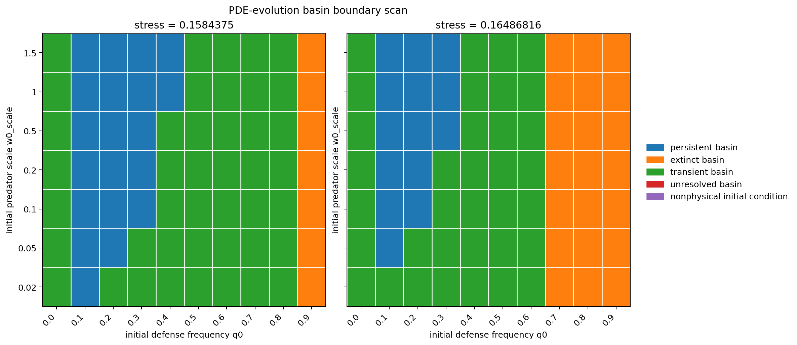

# Research Note: Basin-Boundary Structure in the Spatial Eco-Evolutionary Rescue Model

## Executive Summary

The well-mixed ODE supports indirect evolutionary rescue through prey defense evolution. The spatial PDE does not admit a simple scalar rescue threshold in the tested stress range. Instead, it shows hysteresis and bistability.

PR #9 shows that basin entry depends on the initial defense frequency `q0` and predator abundance scale `w0_scale`. Therefore, the spatial model is best described by reachable outcome basins rather than a single threshold.

## Current Endpoint

The current endpoint is:

```text
Current conclusion: the spatial eco-evolutionary model has a bistable rescue structure. Initial defense frequency and predator abundance help determine whether predator persistence or extinction is reached at the same stress.
```

This endpoint preserves the ODE result while correcting the spatial PDE interpretation. The ODE rescue mechanism remains supported, but the spatial PDE response is path-dependent and initial-condition-dependent.

## Model Sequence

The modeling sequence established three main results.

First, fixed-defense spatial Roy-style PDE dynamics did not produce robust predator rescue. The best fixed-defense candidate at `D_w/D_u=150` was classified as `transient_or_numerical_candidate`.

Second, the well-mixed eco-evolutionary ODE supported indirect evolutionary rescue. The ODE thresholds were:

```text
m_c^{ODE,no evo} = 0.069448242
m_c^{ODE,evo} = 0.16486816
Delta_evo_ODE = 0.095419922
```

In the ODE rescue window, prey defense frequency decreased from about `0.6726` to about `0.3336`, consistent with reduced defense and increased palatability supporting predator recovery.

Third, the spatial eco-evolutionary PDE could not be reduced to a stable scalar threshold. Later analyses showed classifier sensitivity, unresolved long transients, hysteresis, and bistability.

## Why Threshold Language Failed

The first spatial PDE threshold comparison suggested a lower PDE-evo threshold than the ODE-evo threshold. That comparison was useful as an early diagnostic, but it was not a stable final interpretation.

The threshold language failed for three reasons:

- PR #4 found `pde_evo_threshold_classifier_sensitive`.
- PR #5 found `pde_evo_persistence_unresolved`.
- PR #6 found `pde_evo_hysteresis_detected`.

Together, these results showed that the spatial PDE did not behave like a single monotone stress-response curve.

## Bistability and Hysteresis

PR #7 mapped reachable outcomes and found:

```text
pde_evo_bistability_mapped
```

The focused basin map included:

```text
0.141262205: persistent_transient_mixed
0.15: persistent_transient_mixed
0.1584375: bistable_persistent_extinct
0.16486816: bistable_persistent_extinct
0.175: bistable_persistent_extinct
```

This established that predator-persistent and predator-extinct outcomes can both be reachable at the same stress.

## Basin-Boundary Scan

PR #9 scanned `q0` and `w0_scale` at two stresses inside the bistable interval. The final Step 15 label was:

```text
basin_boundary_mapped
```

The stress-level summary was:

| stress | persistent | extinct | transient | unresolved | nonphysical | regime |
|---:|---:|---:|---:|---:|---:|---|
| 0.1584375 | 20 | 7 | 43 | 0 | 0 | `bistable_persistent_extinct` |
| 0.16486816 | 14 | 21 | 35 | 0 | 0 | `bistable_persistent_extinct` |



## Interpretation of q0 and w0 Dependence

Defense state is a major basin-entry coordinate. Low-to-intermediate `q0` values more often enter predator-persistent outcomes, while high-defense initial states more often enter predator-extinct outcomes at the focused stresses.

Predator initial abundance also matters. Within the low-to-intermediate `q0` range, `w0_scale` modulates whether the system enters predator-persistent or transient/extinct regions.

Transient outcomes remain common. The basin boundary is therefore not fully sharp at the current horizon and should be refined adaptively rather than treated as a finished separatrix.

## Current Scientific Conclusion

Current conclusion: the spatial eco-evolutionary model has a bistable rescue structure. Initial defense frequency and predator abundance help determine whether predator persistence or extinction is reached at the same stress.

The spatial PDE has bistable and path-dependent rescue dynamics. It should be analyzed through reachable outcome basins and basin boundaries, not through a single scalar persistence threshold.

## Files

Key notes:

```text
research_notes/roy_evo_spatial_rescue_summary.md
research_notes/roy_project_synthesis_after_bistability.md
research_notes/roy_pde_evo_basin_boundary_scan.md
research_notes/roy_project_synthesis_after_basin_boundary.md
```

Key result tables:

```text
results/roy_pde_evo_basin_boundary_scan.csv
results/roy_pde_evo_basin_boundary_summary.csv
```

Figure:

```text
figures/roy_evo_spatial/17_basin_boundary_heatmap.png
```

## Next Research Direction

The next research direction is adaptive refinement of the basin boundary, not another threshold scan. The next quantitative question is how the separatrix in `q0`-`w0` space changes with stress.
