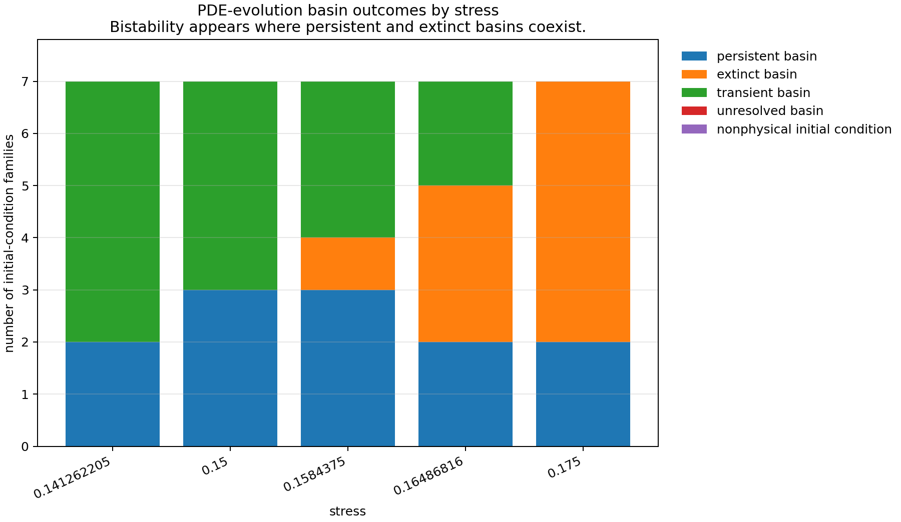

# Research Note: Eco-Evolutionary Rescue, Spatial Dynamics, and Bistability

## Executive Summary

The project now has a corrected spatial eco-evolutionary narrative. Fixed-defense spatial patterning did not produce robust predator rescue. Prey defense evolution did produce indirect evolutionary rescue in the well-mixed ODE. The first spatial PDE threshold comparison suggested a lower PDE-evo rescue threshold than the ODE-evo threshold, but later diagnostics showed that this threshold framing was too simple.

The current result is not a simple suppression result. It is a bistability result. In the mapped stress range, the spatial PDE can reach predator-persistent or predator-extinct outcomes depending on initial condition or continuation path.

## What Was Tested

The work followed three routes:

1. A fixed-defense Roy-style spatial PDE, where prey defense/toxicity was held fixed.
2. A well-mixed eco-evolutionary ODE, where prey defense frequency `q` could evolve.
3. A spatial eco-evolutionary PDE, where prey density `n`, predator density `w`, and prey defense frequency `q` diffuse and react locally.

The scientific question shifted as the evidence changed. The first PDE question was whether spatial diffusion amplifies or suppresses the ODE evolutionary rescue threshold. After classifier sensitivity, continuation hysteresis, and basin mapping, the correct question became which stress-response regimes and basins are reachable.

## Fixed-Defense Spatial Model

The fixed-defense spatial Roy-style PDE did not produce robust `ODE extinct, PDE persistent` rescue. The best fixed-defense candidate occurred at `D_w/D_u=150`, but it failed validation and was classified as `transient_or_numerical_candidate`.

That result established that fixed spatial patterning alone was not enough to support a robust predator-rescue claim in the tested model.

## ODE Eco-Evolutionary Rescue

The well-mixed eco-evolutionary model introduced prey defense frequency `q`. Defense lowers prey growth and predator conversion, but it also lowers predation pressure. Under predator mortality stress, reduced predator pressure can select lower defense, increasing prey growth and palatability and allowing predator recovery.

The ODE thresholds were:

```text
m_c^{ODE,no evo} = 0.069448242
m_c^{ODE,evo} = 0.16486816
Delta_evo_ODE = 0.095419922
```

In the ODE rescue window, `q` decreased from about `0.6726` to about `0.3336`.

The Step 09A conclusion was:

```text
ODE_indirect_evolutionary_rescue_supported
```

## Spatial PDE: From Threshold Suppression to Bistability

The first spatial PDE threshold comparison reported:

```text
Representative Stage B PDE no-evolution threshold = 0.06921875
Representative Stage B PDE evolution threshold = 0.11765625
```

Because `0.11765625` is below the ODE-evo threshold `0.16486816`, this initially suggested a lower PDE-evo threshold than ODE-evo.

That interpretation was later corrected. The subsequent diagnostic sequence found:

```text
PR #4: pde_evo_threshold_classifier_sensitive
PR #5: pde_evo_persistence_unresolved
PR #6: pde_evo_hysteresis_detected
PR #7: pde_evo_bistability_mapped
```

The basin-mapping result means a single scalar PDE-evo threshold is inappropriate in the mapped stress range.

## Why the Threshold Narrative Changed

The threshold narrative changed because the spatial PDE did not behave like a single monotone stress-response curve.

PR #4 showed that persistence classification depended on tail fraction, time horizon, and whether the tail-slope rule was enforced.

PR #5 showed that multi-horizon classification did not resolve a stable PDE-evo boundary.

PR #6 showed continuation direction dependence: upward continuation could keep predator persistence at high stress, while downward continuation could remain extinct or transient at the same stress values.

PR #7 showed that this was not only a continuation artifact. Different initial-condition families led to different reachable outcomes at the same stress.

## Basin-Regime Map

The focused PR #7 basin scan produced the following stress-regime map:

```text
0.141262205: persistent_transient_mixed
0.15: persistent_transient_mixed
0.1584375: bistable_persistent_extinct
0.16486816: bistable_persistent_extinct
0.175: bistable_persistent_extinct
```



Bistability appears where persistent and extinct basin outcomes coexist across initial-condition families.

## Current Scientific Conclusion

ODE prey defense evolution supports indirect evolutionary rescue. In the spatial PDE, the evolutionary rescue response is path-dependent and initial-condition-dependent in the tested stress range.

A single scalar PDE-evo threshold is inappropriate in the mapped stress range. The PDE eco-evolutionary model has stress-response regimes, including persistent/transient mixed regimes and bistable persistent/extinct regimes.

The next research direction is to quantify basin boundaries within the bistable interval, not to keep refining a scalar threshold.

## Files

Key notes:

```text
research_notes/roy_evo_spatial_rescue_summary.md
research_notes/roy_pde_evo_persistence_criterion.md
research_notes/roy_pde_evo_hysteresis_basin_map.md
research_notes/roy_project_synthesis_after_bistability.md
```

Key result tables:

```text
results/roy_evo_ode_threshold_scan.csv
results/roy_evo_spatial_threshold_comparison.csv
results/roy_pde_evo_persistence_stability.csv
results/roy_pde_evo_persistence_stability_summary.csv
results/roy_pde_evo_hysteresis_map.csv
results/roy_pde_evo_basin_initial_condition_scan.csv
```

Figure:

```text
figures/roy_evo_spatial/13_basin_regime_map.png
```

Reproducible plotting script:

```text
experiments/16_plot_roy_basin_regime_map.py
```

## Next Research Direction

Quantify basin boundaries within the bistable interval and identify which initial-condition dimensions move trajectories into predator-persistent, predator-extinct, or long-transient regimes.
